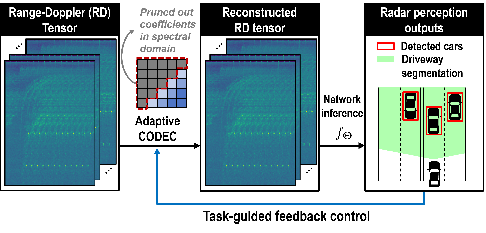

<div align="center">

# 📶 AdaRadar: Adaptive Radar Data Compression (CVPR 2026)

[Jinho Park](https://scholar.google.com/citations?user=vkWRJIAAAAAJ&hl=en)<sup>1</sup> &nbsp;&nbsp;&nbsp; 
[Se Young Chun](https://scholar.google.com/citations?user=3jLuG64AAAAJ&hl=en)<sup>2</sup> &nbsp;&nbsp;&nbsp; 
[Mingoo Seok](https://scholar.google.com/citations?user=OPECx0sAAAAJ&hl=en)<sup>1</sup>

<sup>1</sup>**Columbia University** &nbsp;&nbsp;&nbsp;&nbsp; 
<sup>2</sup>**Seoul National University**

</div>

[](https://jp4327.github.io/adaradar/)

This repository contains the evaluation code for the following paper: AdaRadar: Rate Adaptive Spectral Compression for Radar-based Perception



## 💡Abstract

>Radar is a critical perception modality in autonomous driving systems due to its all-weather characteristics and ability to measure range and Doppler velocity. However, the sheer volume of high-dimensional raw radar data saturates the communication link to the computing engine (e.g., an NPU), which is often a low-bandwidth interface with data rate provisioned only for a few low-resolution range-Doppler frames. A generalized codec for utilizing high-dimensional radar data is notably absent, while existing image-domain approaches are unsuitable, as they typically operate at fixed compression ratios and fail to adapt to varying or adversarial conditions. In light of this, we propose radar data compression with adaptive feedback. It dynamically adjusts the compression ratio by performing gradient descent from the proxy gradient of detection confidence with respect to the compression rate. We employ a zeroth-order gradient approximation as it enables gradient computation even with non-differentiable core operations--pruning and quantization. This also avoids transmitting the gradient tensors over the band-limited link, which, if estimated, would be as large as the original radar data. In addition, we have found that radar feature maps are heavily concentrated on a few frequency components. Thus, we apply the discrete cosine transform to the radar data cubes and selectively prune out the coefficients effectively. We preserve the dynamic range of each radar patch through scaled quantization. Combining those techniques, our proposed online adaptive compression scheme achieves over 100x feature size reduction at minimal performance drop (~1%p). We validate our results on the RADIal, CARRADA, and Radatron datasets.


## 🛠️ Installation
Download and create a conda environment by running
```bash
git clone https://github.com/jp4327/adaradar
conda env create --file environment.yaml
conda activate adaradar
```

## 📂 Data Preparation

Please refer to [FFTRadNet](https://github.com/valeoai/RADIal) for instructions on downloading and preprocessing the radar sequences.
The dataset structure looks like the following.
However, AdaRadar only requires the processed FFT data located in ``RaDIal/Ready_to_use/RADIal/``. 
You do not need to download the ``raw_sequences`` (this also applies to FFTRadNet) for a quick startup.

```bash
.
├── checkpoints
│   └── FFTRadNet_RA_192_56_epoch78_loss_172.8239_AP_0.9813.pth
├── miscellaneous
│   └── RADAR_CONFIG.m
├── raw_sequences
│   ├── download_data_gdrive.sh
│   ├── labels_CVPR.csv
│   ├── RECORD@2020-11-21_11.54.31.zip
│   ├── ...
│   └── RECORD@2020-11-21_13.34.15.zip
├── Ready_to_use
│   ├── labels.csv
│   ├── labels_CVPR.csv
│   ├── RADIal
│   ├── RADIal_fixed.zip
│   ├── RADIal.z01
│   ├── ...
│   └── RADIal_.zip
└── scripts
    └── generate_RADIal_from_raw_sequences
```

## ⚙️ Config File Modification
Please modify ``["dataset"]["root_dir"]`` of [./config/config.json](./config/config.json) which currently reads "PLEASE REPLACE: .../Ready_to_use/RADIal."

In addition, modify ``self.labels = ...`` under [./dataset/dataset.py](./dataset/dataset.py).

## 📊 Spectral Compression Demo
Please refer to the [notebook](./Demo_spectral_compression.ipynb) for visualization of a sample range-Doppler image and its compression.

## 💾 Pre-trained Weights

If using pretrained weights, use this [link](https://drive.google.com/drive/folders/1gEl6bKLSeLVE48q1m-nr1vHTxirWvwUc?usp=drive_link) to download weights and place them under ``./checkpoints/``.

## 🚀 Evaluation

Run pre-trained model with commands below for evaluation.

For example, this uses model under 8-bit quantization to test online adaptation and returns frame-wise results that can be used to visualize time-series compression ratio and performance.
```bash
python Evaluation.py \
    --config ./config/config.json \
    --checkpoint ./checkpoints/FFTRadNet_pretrained_8bit.pth \
    --comp_ratio 20 \
    --qbit 8 \
    --enable_feedback \
    --loss_type "balance" \
    --objective "norm" \
    --lr 1 \
    --lambda_val 15 \
    --grad_clip 1 \
    --conf_thd 0.9
```

On the other hand, the following uses model under 4-bit quantization to validate overall performance of AdaRadar using four test sequences: ``'RECORD@2020-11-22_12.45.05'``,``'RECORD@2020-11-22_12.25.47'``,``'RECORD@2020-11-22_12.03.47'``,``'RECORD@2020-11-22_12.54.38'``.
```bash
python Evaluation.py \
    --config ./config/config.json \
    --checkpoint ./checkpoints/FFTRadNet_pretrained_4bit.pth \
    --comp_ratio 12 \
    --qbit 4 \
    --enable_feedback \
    --init_cr_per_scene \
    --loss_type "balance" \
    --objective "add" \
    --lr 1 \
    --lambda_val 1 \
    --grad_clip 1 \
    --conf_thd 0.8 \
    --result_only

```


## 📉 Training

We can train FFTRadNet on compressed radar data.

For example, the following command trains the model with 8-bit quantization with pruning ratio of 20.

```bash
python Train_w_compress.py \
      --config ./config/config_train.json \
      --comp_ratio 20 \
      --bit_width 8
```

On the other hand, the following command trains the model under 4-bit quantization with random pruning ratio.
```bash
python Train_w_compress.py \
      --config ./config/config_train.json \
      --bit_width 4 \
      --cr_random
```


## 🙌 Acknowledgements

This code is based on [RADIal](https://github.com/valeoai/RADIal). We thank the authors for sharing their codes.


## 📝 Reference

If you find our work useful in your research, please consider citing our paper:

> Jinho Park, Se Young Chun, Mingoo Seok, "AdaRadar: Rate Adaptive Spectral Compression for Radar-based Perception", CVPR 2026

```bibtex
@inproceedings{park2026adaradar,
      title={AdaRadar: Rate Adaptive Spectral Compression for Radar-based Perception},
      author={Park, Jinho and Chun, Se Young and Seok, Mingoo},
      booktitle={Proceedings of the IEEE/CVF Conference on Computer Vision and Pattern Recognition},
      year={2026},
}
```
